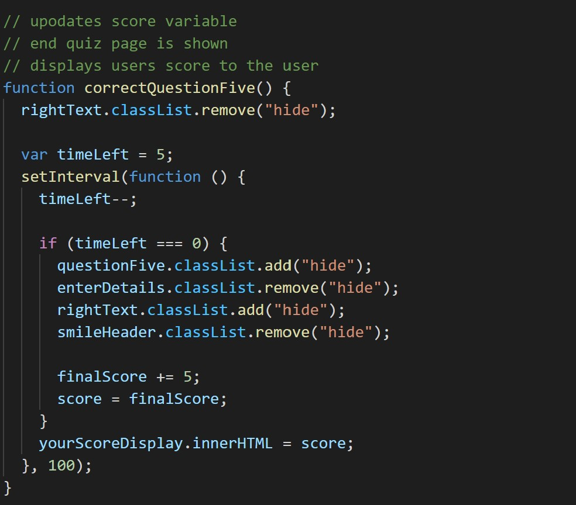
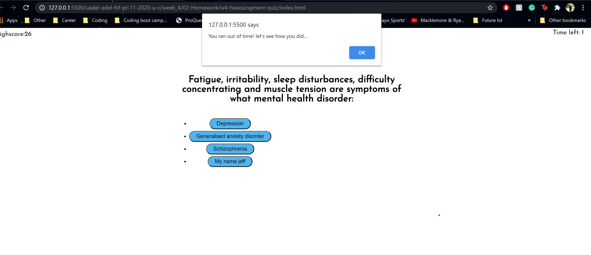

# w4-hwassingment-quiz
## Motivation 
This project portrays the continued development of my Javascript abilities. Utilising a larger amount of time over class break to practice and use many of the practices learnt in the last 5 weeks. Including using semantic html and css for the static webpage and large chunks of javascript as the interaction between computer and user increases. Introduction of querySelectors and method uses allow more things to be done with javascript code.

## Installation
- semantic html and css was made for the static layout of the quiz
- "hide" class was used and style to remove and show the correct parts of the code

In javascript: 
- QuerySelector was used to get html elements and store them as Javascript variables
- Arrays stored each question and the correct and incorrect answers 
- A function was used to run through each question, to add and remove hide class using the classList property for each question that executed each time a answer was clicked.
- The "hide" class was used to show and hide adding intials and submiting them as well as showing the highscores to the page. 
- Local storage was used to store the Users score and their user name upon using the submit button in the end-quiz class.
- A for loop was used to append these details to the scorecard at the end of the quiz.
- The timer and score were declared in the global scope but were altered within functions depending on user interaction. 
- Go back refreshes the page to restart the quiz, the scores and details are preserved in local storage
- Clear highscores uses the splice method to remove them
- Event listeners were used to execute functions such as the ones mentioned above when the user clicks on a button

## Usage

The above images present the code and the execution of the toggleDisplay function when the timer reaches 0. It begins when the quiz is started and will run until either the last question is answered or the timer reaches 0 from 120 seconds. It will then skip any remaining questions and ask user to submit their initials for their final score. 

## Credits
https://fdossena.com/?p=html5cool/buttons/i.frag

## Licnece 
MIT License

Copyright (c) [2020] [Ben Cyna]

Permission is hereby granted, free of charge, to any person obtaining a copy
of this software and associated documentation files (the "Software"), to deal
in the Software without restriction, including without limitation the rights
to use, copy, modify, merge, publish, distribute, sublicense, and/or sell
copies of the Software, and to permit persons to whom the Software is
furnished to do so, subject to the following conditions:

The above copyright notice and this permission notice shall be included in all
copies or substantial portions of the Software.

THE SOFTWARE IS PROVIDED "AS IS", WITHOUT WARRANTY OF ANY KIND, EXPRESS OR
IMPLIED, INCLUDING BUT NOT LIMITED TO THE WARRANTIES OF MERCHANTABILITY,
FITNESS FOR A PARTICULAR PURPOSE AND NONINFRINGEMENT. IN NO EVENT SHALL THE
AUTHORS OR COPYRIGHT HOLDERS BE LIABLE FOR ANY CLAIM, DAMAGES OR OTHER
LIABILITY, WHETHER IN AN ACTION OF CONTRACT, TORT OR OTHERWISE, ARISING FROM,
OUT OF OR IN CONNECTION WITH THE SOFTWARE OR THE USE OR OTHER DEALINGS IN THE
SOFTWARE.

## working product 